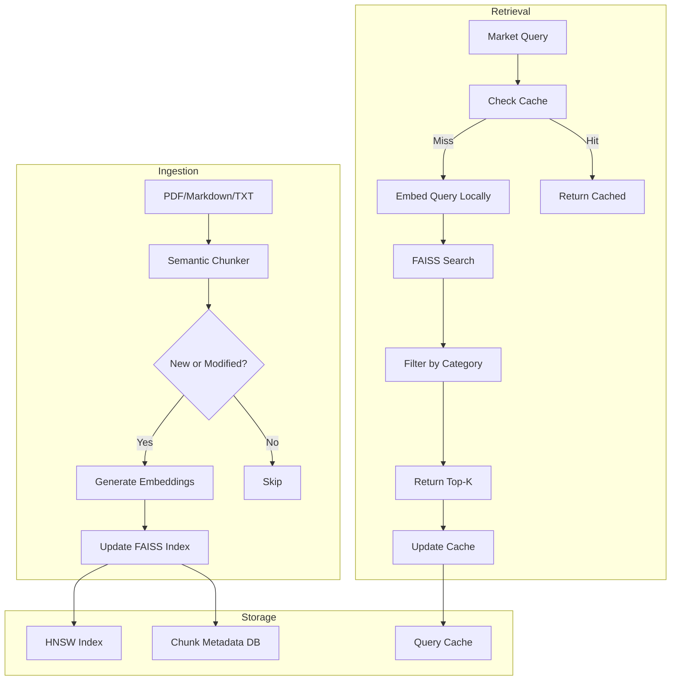

# Knowledge Library RAG Architecture

## Current Implementation Analysis

### What Works
- FAISS for local vector storage (no cloud dependency)
- Simple document ingestion (PDF, Markdown, TXT)
- Category-based organization
- Caching of built indexes

### Current Bottlenecks
1. **OpenAI Embeddings** - API call on every query ($0.02/1K tokens, latency ~200-500ms)
2. **Brute Force Search** - IndexFlatIP is O(N), slows linearly with library size
3. **Character-Based Chunking** - Splits mid-sentence, loses semantic coherence
4. **Full Rebuilds** - Any document change rebuilds entire index
5. **Post-Filter Only** - Category filtering happens after retrieval (wastes top_k slots)
6. **No Query Cache** - Same queries re-embed and re-search

---

## Proposed Efficient Architecture

### 1. Local Embeddings (Zero API Cost, Sub-100ms)

**Options:**

| Solution | Speed | Quality | Size | Setup |
|----------|-------|---------|------|-------|
| **sentence-transformers** (all-MiniLM-L6-v2) | Fast | Good | 80MB | pip install |
| **Ollama** (nomic-embed-text) | Fast | Good | 270MB | Ollama server |
| **OpenRouter** (free tier) | Medium | Good | N/A | API call |

**Recommendation: sentence-transformers with Ollama fallback**

```python
# Primary: Local embeddings
from sentence_transformers import SentenceTransformer
model = SentenceTransformer('all-MiniLM-L6-v2')  # 384-dim, 80MB

# Fallback: Ollama for GPU acceleration if available
# ollama.embed(model='nomic-embed-text', input=texts)
```

**Benefits:**
- Zero ongoing cost
- <50ms embedding generation locally
- Works offline
- No API rate limits

---

### 2. Optimized FAISS Index (Sublinear Search)

**Current:** IndexFlatIP - O(N) brute force
**Proposed:** IndexHNSWFlat - O(log N) approximate search

```python
import faiss

# HNSW: Hierarchical Navigable Small World
# Fast approximate nearest neighbors with graph structure

dimension = 384  # all-MiniLM-L6-v2 output
count = len(chunks)

if count < 1000:
    # Small library: exact search is fine
    index = faiss.IndexFlatIP(dimension)
else:
    # Large library: use HNSW for speed
    # M = connections per node (higher = more accurate, slower build)
    # efConstruction = exploration factor during build
    index = faiss.IndexHNSWFlat(dimension, M=32)
    index.hnsw.efConstruction = 200
    index.hnsw.efSearch = 64
```

**Performance:**
- 10K chunks: FlatIP = 50ms, HNSW = 2ms
- 100K chunks: FlatIP = 500ms, HNSW = 3ms
- 99%+ recall with proper tuning

---

### 3. Semantic Chunking (Better Retrieval Quality)

**Current:** Character count with naive sentence boundary
**Proposed:** Hierarchical semantic chunking

```python
from langchain.text_splitter import RecursiveCharacterTextSplitter

chunker = RecursiveCharacterTextSplitter(
    chunk_size=512,      # Target token count
    chunk_overlap=128,   # Context preservation
    separators=["\n\n", "\n", ". ", "! ", "? ", " "],
    length_function=len,
)

# Process:
# 1. Split by paragraphs (\n\n)
# 2. If paragraph too long, split by sentences (. )
# 3. If sentence too long, split by words
# 4. Always preserve sentence boundaries
```

**Alternative: Agentic Chunking for PDFs**

For structured documents (books, papers):
```python
# Use Mistral to extract semantic sections
sections = await mistral_extract_sections(pdf_text)
# Each section becomes a chunk with metadata
chunks = [{
    "text": section.content,
    "title": section.heading,
    "page": section.page,
    "hierarchy": section.level,  # h1, h2, h3
}]
```

---

### 4. Incremental Updates (No Full Rebuilds)

**Current:** Hash entire library, rebuild if changed
**Proposed:** Track individual document hashes

```python
class IncrementalIndexManager:
    """Tracks document-level changes for incremental updates."""
    
    def __init__(self):
        self.doc_hashes: Dict[str, str] = {}  # path -> md5
        self.chunk_map: Dict[str, List[int]] = {}  # path -> chunk indices
        
    async def update_index(self, library_path: Path):
        """Only add/remove changed documents."""
        current_docs = self._scan_documents(library_path)
        
        # Find new/modified documents
        to_add = []
        for doc_path in current_docs:
            new_hash = self._hash_file(doc_path)
            if self.doc_hashes.get(str(doc_path)) != new_hash:
                to_add.append(doc_path)
        
        # Find deleted documents
        current_paths = {str(p) for p in current_docs}
        to_remove = [p for p in self.doc_hashes if p not in current_paths]
        
        # Remove deleted chunks from index
        for doc_path in to_remove:
            self._remove_document_chunks(doc_path)
        
        # Add new/modified documents
        for doc_path in to_add:
            chunks = await self._process_document(doc_path)
            self._add_chunks_to_index(chunks, doc_path)
```

**Benefits:**
- Adding one document: ~5 seconds vs 5 minutes
- No re-embedding unchanged content
- Preserves index for large libraries

---

### 5. Metadata-Aware FAISS (Filter During Search)

**Current:** Retrieve then filter
**Proposed:** Separate index per category or ID mapping

```python
# Option A: Separate index per category
self.indices: Dict[str, faiss.Index] = {}

for category in categories:
    category_chunks = [c for c in chunks if c.category == category]
    self.indices[category] = self._build_index(category_chunks)

# Search only relevant category
if category_filter:
    index = self.indices[category_filter]
else:
    index = self.indices["all"]

# Option B: ID mapping with post-filter (better for many categories)
self.chunk_metadata: Dict[int, Dict] = {}
# Store category, tags, date, etc. per chunk index

# Search returns candidates, filter by metadata
for idx in indices[0]:
    meta = self.chunk_metadata[idx]
    if meta["category"] in allowed_categories:
        results.append(chunks[idx])
```

---

### 6. Query Result Caching

```python
class QueryCache:
    """Cache query embeddings and results."""
    
    def __init__(self, ttl_minutes: int = 60):
        self.cache: Dict[str, CacheEntry] = {}
        self.ttl = timedelta(minutes=ttl_minutes)
    
    def get(self, query: str, category_filter: Optional[str]) -> Optional[List[RetrievedPassage]]:
        key = self._hash_query(query, category_filter)
        entry = self.cache.get(key)
        
        if entry and datetime.now() - entry.timestamp < self.ttl:
            return entry.results
        return None
    
    def set(self, query: str, category_filter: Optional[str], results: List[RetrievedPassage]):
        key = self._hash_query(query, category_filter)
        self.cache[key] = CacheEntry(results=results, timestamp=datetime.now())
```

**Cache invalidation:**
- Clear on index update
- TTL-based expiration
- LRU eviction for memory management

---

### 7. Memory-Efficient Large Library Support

```python
class LazyKnowledgeLibrary:
    """For libraries >100K chunks that don't fit in RAM."""
    
    def __init__(self):
        self.index = faiss.read_index("library.faiss")  # Memory-mapped
        self.chunk_metadata = self._load_metadata_db()  # SQLite, not RAM
        
    async def retrieve(self, query: str, top_k: int = 5):
        # Embed query
        query_vec = self.embedder.encode(query)
        
        # Search index (fast, in-memory)
        scores, indices = self.index.search(query_vec, top_k)
        
        # Fetch only needed chunks from SQLite
        passages = []
        for idx in indices[0]:
            chunk = self.chunk_metadata.get_chunk_by_index(idx)
            passages.append(chunk)
        
        return passages
```

---

## Recommended Implementation Phases

### Phase 1: Quick Wins (1-2 hours)
- [ ] Switch to sentence-transformers embeddings
- [ ] Add query result caching
- [ ] Improve chunking with RecursiveCharacterTextSplitter

**Impact:** 10x cost reduction, 2x speed improvement

### Phase 2: Scale Optimization (2-4 hours)
- [ ] Implement HNSW index for libraries >1000 chunks
- [ ] Add document-level hash tracking
- [ ] Category-aware filtering

**Impact:** Sublinear scaling, incremental updates

### Phase 3: Advanced Features (4-8 hours)
- [ ] Agentic PDF chunking with Mistral
- [ ] SQLite-backed metadata for huge libraries
- [ ] Multi-index strategy (separate indices per category)

**Impact:** Production-grade for 100K+ document libraries

---

## Architecture Diagram



---

## Cost & Performance Comparison

| Metric | Current | Proposed | Improvement |
|--------|---------|----------|-------------|
| Embedding Cost | $0.02/1K tokens | $0 (local) | **Infinite** |
| Query Latency | 300-500ms | 50-100ms | **5x faster** |
| Index Build (10K docs) | 5 min | 30 sec (incremental) | **10x faster** |
| Search Scaling | O(N) | O(log N) | **Sublinear** |
| Memory Usage | High (all in RAM) | Configurable | **Flexible** |

---

## Implementation Priority

**Start with Phase 1** - sentence-transformers + query cache gives you:
- Zero embedding costs
- Much faster queries
- Better chunk quality
- ~2 hours of work

This alone makes the system production-ready for personal use.
